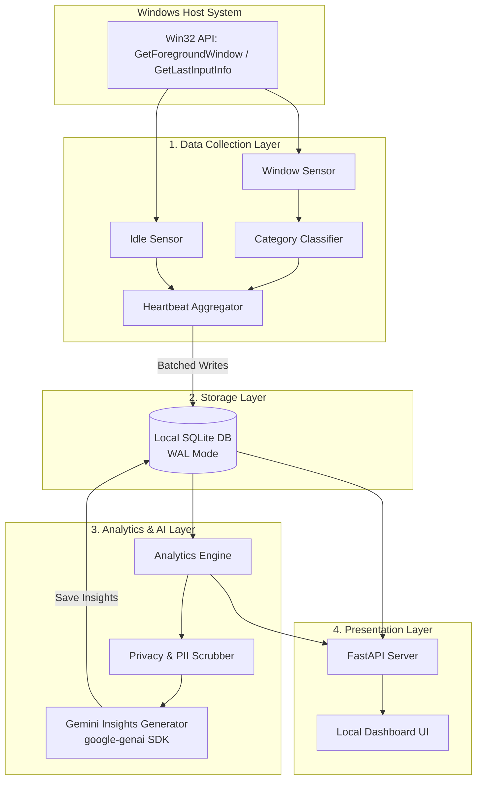
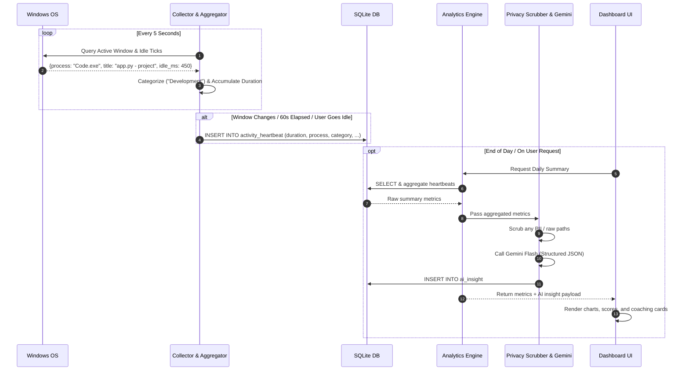
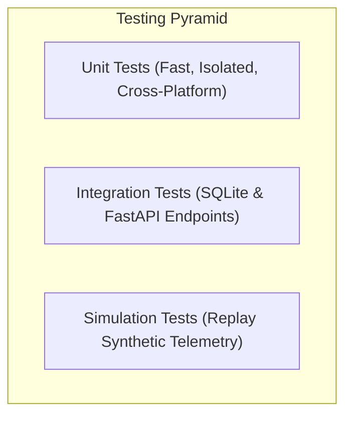

# CodePulse AI — Architecture & System Design Document

## 1. Project Purpose

**CodePulse** is a lightweight, privacy-first developer workflow analytics tool designed to run locally on Windows. Its primary mission is to help individual developers understand and optimize their daily coding routines without invading their privacy or adding unnecessary setup friction.

By passively tracking foreground window activity, detecting idle periods, classifying tasks (e.g., active coding vs. documentation research vs. communication), and leveraging the **Google Gemini API**, CodePulse transforms raw desktop activity into actionable developer productivity insights—such as deep work streaks, context-switching frequency, and personalized workflow coaching.

---

## 2. MVP Scope

The Minimum Viable Product (MVP) is tailored for high reliability, zero bloat, and straightforward maintenance by a student developer.

The MVP encompasses:

1. **Windows Activity Collection**:
   - Non-intrusive foreground window polling (process name and window title) every 5 seconds using standard Win32 APIs (`pywin32` / `psutil`).
   - No administrator privileges required.
2. **Idle Time Detection**:
   - Automatic pause of tracking when physical user input is absent for $\ge 3$ minutes via `GetLastInputInfo`.
3. **Application & Category Classification**:
   - Deterministic rule and regex engine categorizing activity into:
     - `Development` (e.g., VS Code, Cursor, PyCharm, Terminal)
     - `Documentation & Research` (e.g., MDN, Stack Overflow, GitHub, DevDocs in browsers)
     - `Communication` (e.g., Slack, Teams, Discord)
     - `Distraction` (e.g., YouTube, Reddit, Social Media)
     - `Other` / `Unclassified`
4. **Heartbeat Aggregation & SQLite Storage**:
   - In-memory event buffering to collapse continuous 5-second ticks into aggregated session intervals (reducing DB write volume by >90%).
   - Embedded local SQLite database configured with Write-Ahead Logging (WAL) for safe, concurrent reads and writes.
5. **Basic Session Analytics**:
   - Calculation of total active time, coding vs. research distribution, deep work blocks ($\ge 25$ minutes of uninterrupted focus), and context-switching counts.
6. **Gemini Workflow Insights**:
   - Structured daily retrospective generation using Gemini Flash (via the official `google-genai` SDK), summarizing accomplishments, identifying high-friction switching periods, and offering constructive coaching advice.
7. **Local Web Dashboard**:
   - A clean, local web UI (FastAPI backend + modern responsive frontend) rendering daily timelines, focus scorecards, category distribution charts, and AI insight reports.

---

## 3. Future Scope (Phase 2 & Beyond)

The architecture is explicitly decoupled so these features can be plugged in without refactoring core components:

* **Phase 2 — Git Repository Monitoring**:
  - Passive tracking of local Git workspaces (commit cadence, branch changes, lines inserted/deleted) via a dedicated `GitSensor`.
* **Phase 2 — Interactive Conversational AI Agent**:
  - Natural language chat assistant using Gemini Tool Calling / Function Calling to query the local SQLite database on demand (e.g., *"How many hours did I spend in VS Code on Tuesday?"*).
* **Phase 3 — Custom IDE Extensions**:
  - Optional VS Code or JetBrains plugin for granular file-type and language-level telemetry.
* **Phase 3 — Automated Standup & Sprint Summaries**:
  - Exportable daily standups formatted for Slack, Discord, or markdown notes.
* **Phase 4 — Team / Organization Aggregations (Opt-in)**:
  - Anonymized, opt-in metric sharing for team cadence insights without individual surveillance.

---

## 4. Anti-Goals (What We Explicitly Will NOT Build)

To protect user trust, avoid antivirus false positives, and keep the codebase manageable:

1. **NO Keystroke Logging**: We will never record individual keystrokes, keystroke frequencies, or key sequences.
2. **NO Screen Recording or OCR**: We will never capture screenshots, video frames, or use optical character recognition.
3. **NO Source Code Extraction**: We will never read, parse, or upload the contents of source code files.
4. **NO Sensitive Data or Password Capture**: We will never capture passwords, private tokens, or sensitive browser query parameters.
5. **NO Burnout or Fatigue Prediction**: We will not attempt pseudoscientific cognitive or emotional state predictions; metrics remain purely objective and actionable.
6. **NO Cloud Multi-Tenant SaaS / Complex Auth**: Everything runs locally on `localhost` with a personal SQLite file and direct client-to-Gemini API communication.

---

## 5. System Architecture

CodePulse is built on a **Modular Layered Architecture**. Each layer operates independently with well-defined interfaces, allowing new collectors (like Git) or new consumers (like an AI agent) to attach without modifying existing layers.



---

## 6. Component Responsibilities

| Component | Layer | Core Responsibility |
| :--- | :--- | :--- |
| **`WindowSensor`** | Collection | Polls the Windows OS every 5s to retrieve active window title, process ID, and executable name (`pywin32` / `psutil`). |
| **`IdleSensor`** | Collection | Checks elapsed time since last user keyboard/mouse input via `GetLastInputInfo`. |
| **`Classifier`** | Collection | Evaluates process names and titles against configurable regex rules to assign categories (`Development`, `Docs`, `Comms`, `Distraction`). |
| **`HeartbeatAggregator`** | Collection | Accumulates continuous active 5s ticks in memory and emits consolidated heartbeat blocks upon window change, idle state, or time thresholds (60s). |
| **`DatabaseManager`** | Storage | Manages SQLite connection lifecycle, initializes tables, and enables WAL mode pragmas. |
| **`AnalyticsEngine`** | Analytics | Computes aggregate metrics from database rows: daily active time, category breakdowns, deep work blocks, and context switch indices. |
| **`PrivacyScrubber`** | AI / Security | Sanitizes window titles, strips URL query parameters, normalizes file paths, and ignores blacklisted applications before external API exposure. |
| **`GeminiClient`** | AI | Formats sanitized metrics into structured prompts and calls Gemini Flash using strict Pydantic JSON schemas. |
| **`FastAPI Service`** | Presentation | Exposes REST endpoints (`/api/analytics/daily`, `/api/insights/daily`) and serves static dashboard UI files. |
| **`Dashboard UI`** | Presentation | Renders metrics, interactive timelines, project distributions, and Gemini insights in the browser. |

---

## 7. End-to-End Data Flow



---

## 8. Database Design

### SQLite Pragmas (Applied on Connection)
```sql
PRAGMA journal_mode = WAL;          -- High concurrency between collector and dashboard
PRAGMA synchronous = NORMAL;        -- Balanced write durability and speed
PRAGMA foreign_keys = ON;           -- Enforce relational integrity
PRAGMA busy_timeout = 5000;         -- 5-second wait if locked
```

### Table Definitions

```sql
-- 1. Aggregated Window & Process Activities
CREATE TABLE IF NOT EXISTS activity_heartbeat (
    id INTEGER PRIMARY KEY AUTOINCREMENT,
    timestamp_start TEXT NOT NULL,         -- ISO-8601 UTC (e.g. 2026-08-16T15:30:00Z)
    timestamp_end TEXT NOT NULL,           -- ISO-8601 UTC
    duration_seconds INTEGER NOT NULL,     -- Aggregated elapsed seconds
    process_name TEXT NOT NULL,            -- e.g. "Code.exe", "chrome.exe"
    window_title TEXT,                     -- Sanitized window title
    category TEXT NOT NULL,                -- "Development", "Research", "Communication", "Distraction", "Other"
    project_tag TEXT,                      -- Inferred workspace or project name
    is_idle INTEGER DEFAULT 0              -- 0 = Active, 1 = Idle
);

CREATE INDEX IF NOT EXISTS idx_activity_time ON activity_heartbeat(timestamp_start, timestamp_end);
CREATE INDEX IF NOT EXISTS idx_activity_category ON activity_heartbeat(category);

-- 2. Pre-Calculated Daily Metrics
CREATE TABLE IF NOT EXISTS daily_summary (
    date TEXT PRIMARY KEY,                 -- YYYY-MM-DD
    total_active_seconds INTEGER NOT NULL,
    coding_seconds INTEGER NOT NULL,
    research_seconds INTEGER NOT NULL,
    communication_seconds INTEGER NOT NULL,
    distraction_seconds INTEGER NOT NULL,
    deep_work_seconds INTEGER NOT NULL,
    context_switches INTEGER NOT NULL,
    focus_score REAL NOT NULL,             -- 0.0 to 100.0
    top_project TEXT
);

-- 3. Gemini Coaching Insights
CREATE TABLE IF NOT EXISTS ai_insight (
    id INTEGER PRIMARY KEY AUTOINCREMENT,
    date TEXT NOT NULL,
    created_at TEXT NOT NULL,
    headline TEXT NOT NULL,
    summary_markdown TEXT NOT NULL,
    recommendations_json TEXT,             -- JSON Array of actionable items
    productivity_score REAL,
    FOREIGN KEY(date) REFERENCES daily_summary(date) ON DELETE CASCADE
);

-- 4. Phase 2 Future-Proofing: Git Events (Placeholder Schema)
CREATE TABLE IF NOT EXISTS git_event (
    id INTEGER PRIMARY KEY AUTOINCREMENT,
    timestamp TEXT NOT NULL,
    repo_name TEXT NOT NULL,
    branch TEXT NOT NULL,
    commit_hash TEXT UNIQUE NOT NULL,
    commit_message TEXT,
    files_changed INTEGER DEFAULT 0,
    insertions INTEGER DEFAULT 0,
    deletions INTEGER DEFAULT 0
);
```

---

## 9. Privacy & Security Model

CodePulse is built on strict **zero-surveillance, local-first** principles:

1. **Local-Only Storage**:
   - `codepulse.db` stays exclusively on the user’s local storage. No background telemetry or analytics are sent to any external server.
2. **Sensitive App Exclusion (Blacklist)**:
   - Password managers (`1Password.exe`, `Bitwarden.exe`, `KeePass.exe`), banking domains, and private messaging applications can be completely ignored or stripped of titles based on user configuration.
3. **Window Title Sanitization**:
   - Local directory paths (e.g., `C:\Users\username\...`) are stripped down to relative workspace paths.
   - URL parameters and authentication tokens (`?token=...`, `?key=...`, email addresses) are scrubbed with regex before database insertion.
4. **Minimal AI Payload**:
   - Gemini receives only **aggregated numerical metrics** (e.g., *"3.5 hours in VS Code, 42 minutes in MDN, 12 context switches"*), not raw window logs, file names, or code snippets.
5. **Secure Credential Storage**:
   - The user’s Gemini API key is stored locally in `.env` or system environment variables and never logged or exposed.

---

## 10. Testing Strategy

The testing architecture is designed so that all components can be tested rapidly on any operating system without requiring actual Windows GUI interactions or live API keys.



### 1. Unit Tests (`pytest`)
- **Classifier Tests**: Verify that given process names and titles (e.g., `Code.exe - main.py`, `chrome.exe - Python Docs`) match the expected category.
- **Privacy Scrubber Tests**: Verify that emails, file paths, and URL query tokens are cleanly purged from window titles.
- **Analytics Math Tests**: Verify the deterministic calculation of Deep Work blocks, Context Switch Index, and Focus Score using synthetic data tables.
- **Win32 Mocks**: Use `unittest.mock` to simulate `GetForegroundWindow` and `GetLastInputInfo` so test suites pass in Linux CI environments.

### 2. Integration Tests
- **Database & Aggregator Tests**: Verify that the in-memory heartbeat buffer flushes properly to SQLite without dropping intervals or creating lock collisions in WAL mode.
- **API Endpoint Tests**: Use FastAPI's `TestClient` to test `/api/analytics/daily` and `/api/insights/daily`.
- **AI Schema Validation**: Verify that mock Gemini JSON responses conform exactly to Pydantic validation schemas.

### 3. Simulation & Replay Tests
- A synthetic trace replayer that feeds 24 hours of simulated developer window events through the collector, aggregator, database, and analytics engine to guarantee stability under sustained operation.
